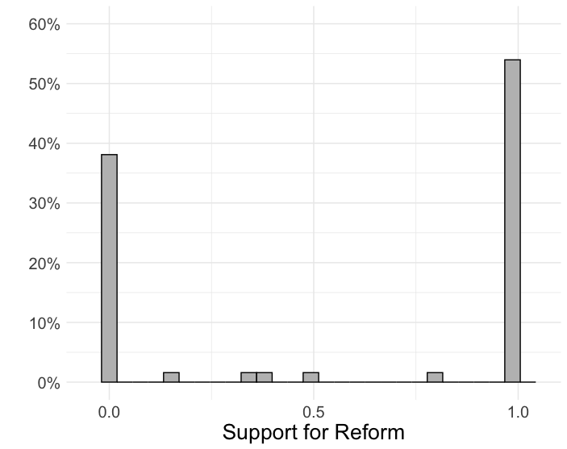
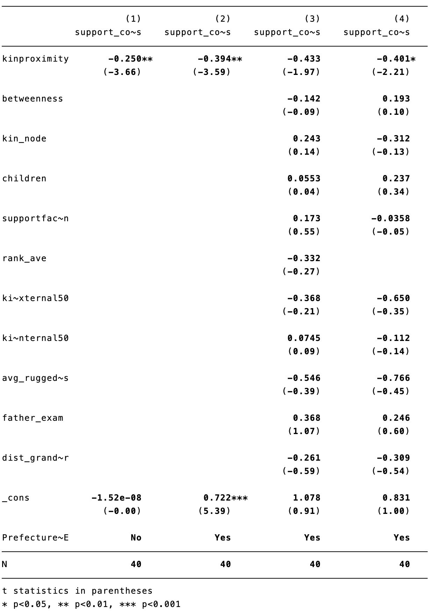
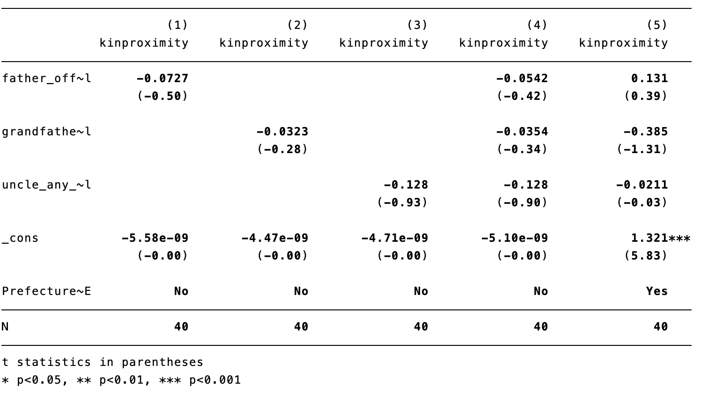
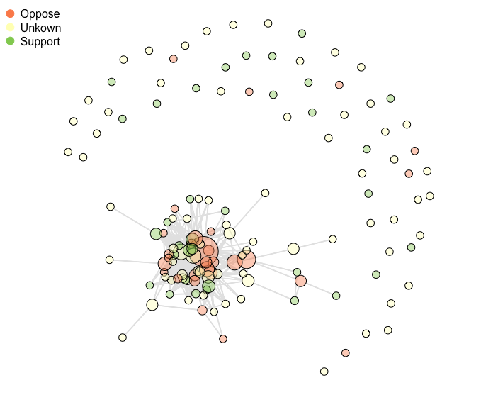
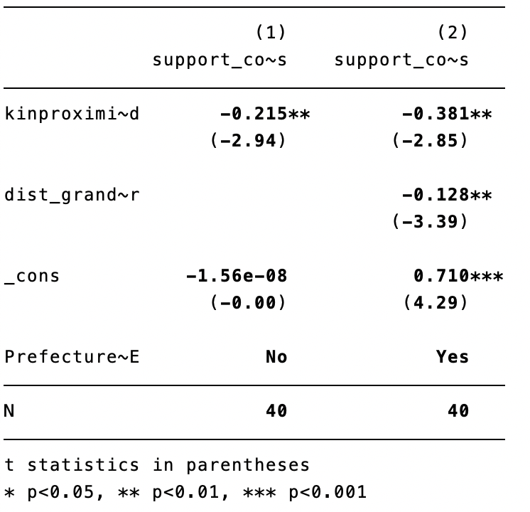
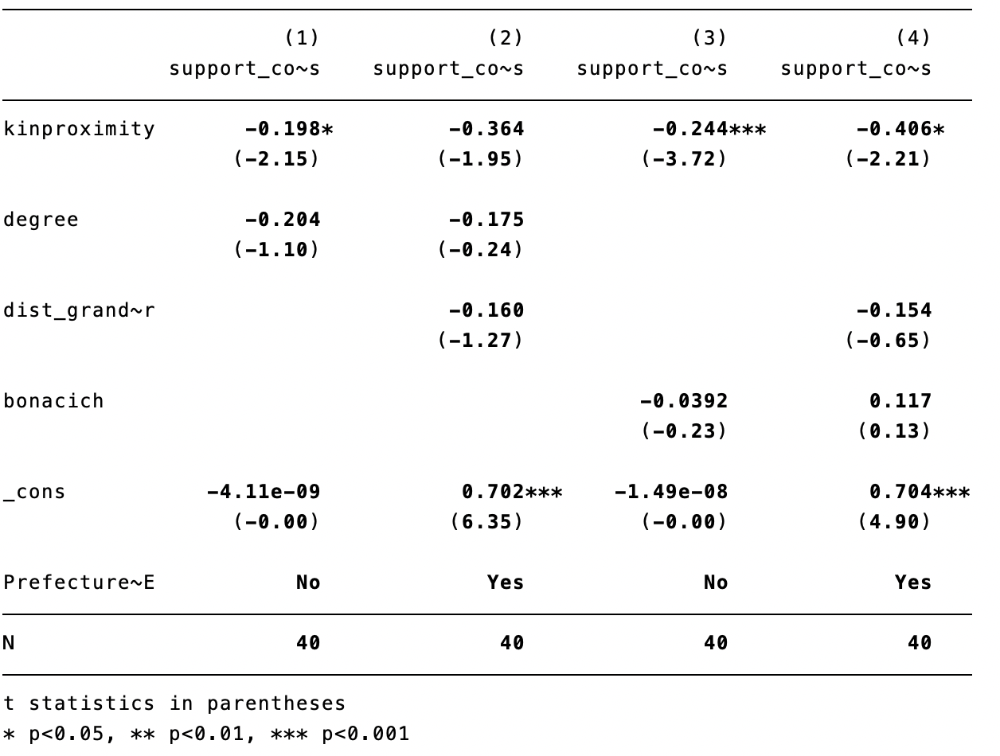

# Replication of "Blood Is Thicker Than Water: Elite Kinship Networks and State Building in Imperial China"

We replicate the network analytics conducted by Dr. Wang from Harvard University

Original paper: Blood is Thicker Than Water: Elite Kinship Networks and State Building in Imperial China

Replication and revision questions are discussed below:

Figure 4:
In this part, we reproduce Figure 4 in the original paper. This figure showed the attitude of politicians. It was a bar plot that had the portion of the support for reform on the y-axis. A value of 1 represents a supportive attitude toward the reform, 0 represents the opposite attitude, and 0.5 stands for a moderate attitude (partially supporting the reform). A total of 63 politicians displayed an attitude toward the reform. The result suggests that 54% of the 63 politicians, which is 34 of them, supported the reform. 38% of them opposed the reform. The supportive and opposite attitude adds up to 92%, and we can see from these statistics that the competition driven by the reform was dramatic. However, the politicians’ attitude collected in this graph is not complete because many of the politicians did not display their attitude.  

Table 2:
In this part, we reproduce Figure 1 in the original paper. In this part of the original paper, the author conducts his main analysis: regression of support for reform on the local concentration of kin and a list of covariates. The result is highly consistent with the main hypothesis that high local concentration is negatively associated with support for the reform. Model 1 is the baseline model with no covariate. Result suggests that there is a negative relationship between the kinship proximity and the support for the reform. The magnitude of the decrease in attitude is -0.25 as we treat the support for the reform as a continuous variable. The result is significant with a 0.001 confidence level, so we can confidently say that there exists a negative relationship. Model 2 adds a fixed effect to the baseline regression. The fixed effect consists of the location of the politician. Adding the fixed effect, we get a significant negative relationship between the kinship proximity and the support for the reform with a 0.01 confidence level. Model 3 adds several potential covariates into the model. However, the negative relationship becomes insignificant under a 0.05 confidence level, and it is still significant with a 0.1 confidence level, which is still acceptable. There are a total of 8 covariates added to the model to get controlled for testing the effect of kin proximity. They are Number of kins, Number of children, Factional tie with reform leader, politician’s average rank, Kin centroid exposure to external wars, Kin centroid exposure to mass rebellions, Ruggedness Index, Father exam, and Father migration. None of these covariates are significant in predicting the support for the reform. However, in model 4, we used Lasso to do variable selection, and we ended up with the variable Father migration is significant. However, the result is surprising because father migration measures the distance of the father’s final residence to the grandfather’s hometown. This variable has a negative relationship with the kin proximity, which means that the politician with a higher father migration is going to have a more dispersed kinship network as well. But these two variables both display a negative relationship with the support of the reform.

Table A1-6:
In this part, we reproduce Table A1-6 in the original paper. This table evaluates the relationship between family members’ occupations and the kinship network. We can see that non of the relatives’ occupations significantly contribute to the estimation of kin proximity. The family members tested are the father, grandfather, and uncles. In Song Dynasty and a broader ancient China, only males were allowed to work for the government, so these occupations terms are measured only for male relatives. 

Figure A1-5:
In this part, we reproduce Figure A1-5 in the original paper. This figure shows the Northern Song Politicians' Marriage Network. Each node is colored by the politicians' attitude toward the reform. Green represents a supportive attitude, red represents the opposite attitude, and yellow is for unknown attitude.

Table A1-15:
In this part, we reproduce Table A1-15 in the original paper. Model 1 has the same structure as the baseline model, but the kinship proximity is weighted by the property of each tie of the politicians. The coefficient for kinship proximity is negative and significant under a 0.01 confidence level, which is aligned with previous results. The result provided by this weighted model should be more convincing because it reflects the mechanism of the family in the Northern Song Dynasty. Firstly, son ties are weighted higher than daughter ties. The reason for this is that normally, families in Northern Song Dynasty valued sons more than daughters because of the family and employment structure during that period of time. The economy is agriculture-based, which requires heavy labor, and male is genetically more suitable to be good labors. With this foundation, a male-centered social structure was built. Only males were allowed to study in schools and work for the government. So each family will spend the majority of their resources on educating and supporting their sons, who had a much higher chance than a daughter to lead and make the whole family prosperous in the future. Second, we value direct and close relatives more than less relevant relatives, and this is also true in Northern Song Dynasty. The result from the weighted network is considered more credible and close to the real world. However, the only concern is that the weight is manually adjusted, which may not reflect the real weight between these ties. So we can take the result as a reference for the estimated effect.

Table A1-17:
In this part, we reproduce Table A1-17 in the original paper. In this part, we estimate the relationship between kinship geography and support for reform with alternative centrality measures. Previously we used betweenness centrality, and now we change the centrality measures to degree and bonacich centrality to see if the results remain significant. With bonacich centrality as a regressor, we can see that the coefficient of kinship proximity remains significant with and without adding the father migration term, which is selected by Lasso previously. However, the model becomes less significant when we change the centrality measurement to degree centrality and even becomes insignificant when we add the father migration term. This issue raises our attention, and we will further check the model with degree centrality later.

