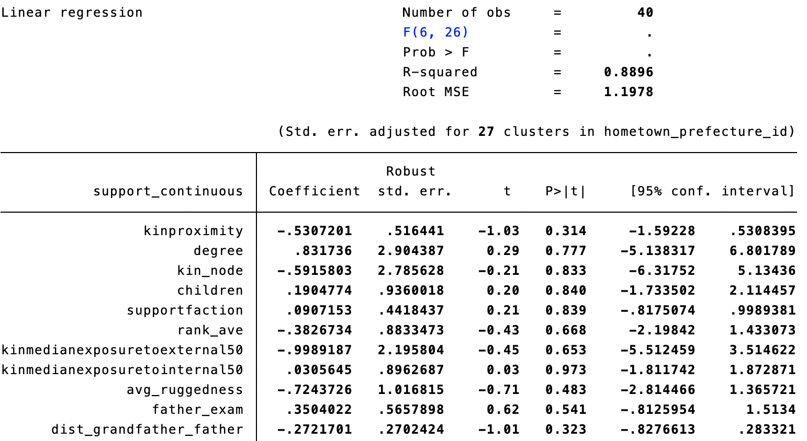

# Replication of "Blood Is Thicker Than Water: Elite Kinship Networks and State Building in Imperial China"

We replicate the network analytics conducted by Dr. Wang from Harvard University

Reference: Wang, Y. (2021). Blood is Thicker Than Water: Elite Kinship Networks and State Building in Imperial China. American Political Science Review, 1-15.

Replication and revisions are discussed below:

# 1 Introduction
In this newest paper ”Blood is Thicker Than Water: Elite Kinship Networks and State Building in Imperial China”, Yuhua Wang explores the relationship between kinship network of politicians (or kinship institutions, as called by the author) and support for state building, using the evidence from a major reform attempt in medieval China. Although previous studies have established the theoretical foundation of the connection between social networks of political actors and their political behavior/preference, Wang (2021) is the first paper that puts forward the causal relationship between elite networks and preferences for strengthening the state. Additionally, using an original elite network data set compiled using tomb epitaph from a thousand years ago, this paper presents comprehensive quantitative empirical evidence on the theoretical linkage. While the way the author constructed the network in this project is novel and incredible, as a new method applied to this subfield recently, more analysis on this work, which further improves our understanding of both the substantive implications and the validity of integrating network analysis to this broad topic, is important. In this replication project, we reproduce main tables and figures in the original paper and made further extensions to existing analysis. The paper is organized as follow. In the next section, we reproduce quantitative analysis in Wang (2012). Then, we conduct our own analysis based on existing data. The last sections includes our own evaluations of the original paper based on our extensions and understandings of the substantive context of the paper.

# 2 Replication
### 2.1 Figure 1:
In this part, we reproduce Figure 1 in the original paper and get the exact same graph as in the original paper. In Figure 1, the author uses two notable political figures as an illustration for social networks: Wang Anshi, who sup- ported the reform, and Lv Gongzhu, who opposed the reform. We can easily see that the network of Wang Anshi is much more dispersed than that of Lv Gongzhu: Wang has connections spread all over the country whereas all of Lu’s connections are located in Northeastern part of the country. Nevertheless, as two individual examples, we certainly can’t draw from these to conclude that those with more dispersed networks are more likely to support the reform. To draw such conclusion, we need systematic data on all politicians at that time.
 

### 2.2 Figure 4:
In this part, we reproduce Figure 4 in the original paper. This figure showed the attitude of politicians. It was a bar plot that had the portion of the support for reform on the y-axis. A value of 1 represents a supportive attitude toward the reform, 0 represents the opposite attitude, and 0.5 stands for a moderate attitude (partially supporting the reform). A total of 63 politicians displayed an attitude toward the reform. The result suggests that 54% of the 63 politicians, which is 34 of them, supported the reform. 38% of them opposed the reform. The supportive and opposite attitude adds up to 92%, and we can see from these statistics that the competition driven by the reform was dramatic. However, the politicians’ attitude collected in this graph is not complete because many of the politicians did not display their attitude.  

### 2.3 Table 2:
In this part, we reproduce Figure 1 in the original paper. In this part of the original paper, the author conducts his main analysis: regression of support for reform on the local concentration of kin and a list of covariates. The result is highly consistent with the main hypothesis that high local concentration is negatively associated with support for the reform. Model 1 is the baseline model with no covariate. Result suggests that there is a negative relationship between the kinship proximity and the support for the reform. The magnitude of the decrease in attitude is -0.25 as we treat the support for the reform as a continuous variable. The result is significant with a 0.001 confidence level, so we can confidently say that there exists a negative relationship. Model 2 adds a fixed effect to the baseline regression. The fixed effect consists of the location of the politician. Adding the fixed effect, we get a significant negative relationship between the kinship proximity and the support for the reform with a 0.01 confidence level. Model 3 adds several potential covariates into the model. However, the negative relationship becomes insignificant under a 0.05 confidence level, and it is still significant with a 0.1 confidence level, which is still acceptable. There are a total of 8 covariates added to the model to get controlled for testing the effect of kin proximity. They are Number of kins, Number of children, Factional tie with reform leader, politician’s average rank, Kin centroid exposure to external wars, Kin centroid exposure to mass rebellions, Ruggedness Index, Father exam, and Father migration. None of these covariates are significant in predicting the support for the reform. However, in model 4, we used Lasso to do variable selection, and we ended up with the variable Father migration is significant. However, the result is surprising because father migration measures the distance of the father’s final residence to the grandfather’s hometown. This variable has a negative relationship with the kin proximity, which means that the politician with a higher father migration is going to have a more dispersed kinship network as well. But these two variables both display a negative relationship with the support of the reform.

### 2.4 Table A1-6:
In this part, we reproduce Table A1-6 in the original paper. This table evaluates the relationship between family members’ occupations and the kinship network. We can see that non of the relatives’ occupations significantly contribute to the estimation of kin proximity. The family members tested are the father, grandfather, and uncles. In Song Dynasty and a broader ancient China, only males were allowed to work for the government, so these occupations terms are measured only for male relatives. 

### 2.5 Figure A1-5:
In this part, we reproduce Figure A1-5 in the original paper. This figure shows the Northern Song Politicians' Marriage Network. Each node is colored by the politicians' attitude toward the reform. Green represents a supportive attitude, red represents the opposite attitude, and yellow is for unknown attitude.

### 2.6 Table A1-15:
In this part, we reproduce Table A1-15 in the original paper. Model 1 has the same structure as the baseline model, but the kinship proximity is weighted by the property of each tie of the politicians. The coefficient for kinship proximity is negative and significant under a 0.01 confidence level, which is aligned with previous results. The result provided by this weighted model should be more convincing because it reflects the mechanism of the family in the Northern Song Dynasty. Firstly, son ties are weighted higher than daughter ties. The reason for this is that normally, families in Northern Song Dynasty valued sons more than daughters because of the family and employment structure during that period of time. The economy is agriculture-based, which requires heavy labor, and male is genetically more suitable to be good labors. With this foundation, a male-centered social structure was built. Only males were allowed to study in schools and work for the government. So each family will spend the majority of their resources on educating and supporting their sons, who had a much higher chance than a daughter to lead and make the whole family prosperous in the future. Second, we value direct and close relatives more than less relevant relatives, and this is also true in Northern Song Dynasty. The result from the weighted network is considered more credible and close to the real world. However, the only concern is that the weight is manually adjusted, which may not reflect the real weight between these ties. So we can take the result as a reference for the estimated effect.

### 2.7 Table A1-17:
In this part, we reproduce Table A1-17 in the original paper. In this part, we estimate the relationship between kinship geography and support for reform with alternative centrality measures. Previously we used betweenness centrality, and now we change the centrality measures to degree and bonacich centrality to see if the results remain significant. With bonacich centrality as a regressor, we can see that the coefficient of kinship proximity remains significant with and without adding the father migration term, which is selected by Lasso previously. However, the model becomes less significant when we change the centrality measurement to degree centrality and even becomes insignificant when we add the father migration term. This issue raises our attention, and we will further check the model with degree centrality later.

# 3 Extension
#### 3.1 Table 2
### 3.1.1 Bootstrapping
In this part, we first perform bootstrapping on Model 1 in table 2, which is the main estimation of the paper. Through random resampling, bootstrapping is widely used in regression analysis to see how coefficients change as the sample undergoes minor changes. While the value of the coefficient largely remains the same, it becomes insignificant at any significance level, suggesting that the result here is highly susceptible to small changes in values.

### 3.1.2 Degree Centrality
Then, we shift to Model 3 in Table 2, which includes both region fixed effects and a set of control variables such as the number of kin, a dummy variable on whether each politician has personal tie with reform leaders, and betweenness centrality of politician marriage network, which measures how important each individual politician is in the whole marriage network. We first include degree centrality, which measures number of ties in the marriage network, as an additional control variable. Surprisingly, the main explanatory variable, the local concentration index, is no longer significant at any significance level. Given that this is a multiple regression with a number of predictors, it’s hard to give an accurate explanation for this finding. One possibility is collinearity: degree centrality might be highly correlated with some other control variables such as betweenness centrality or number of kin. To examine this possibility, we conduct further manipulations.
First, we suspect a high collinearity between degree centrality and betweenness centrality. We then exclude betweenness centrality but keep degree cen- trality. Again, local concentration is not significant.

We also suspect that degree centrality might be highly correlated with num- ber of kin and number of children. We further exclude these two variables. Still, local concentration is not significant.
While from a substantive perspective we have good reasons to suspect that the main variable of interest, local concentration, might be correlated with de- gree centrality, Table A1-17 in the original paper (which we reproduce in the pre- vious section) shows that with only degree centrality added to Model 1 (baseline model), the coefficient remains significant. Thus, although the most plausible explanation is multicollinearity, we can’t specify from a substantive perspective which variable is responsible for this. Moreover, given that both degree centrality and betweenness centrality are legit network centrality measures, we should expect them to have similar properties.

### 3.1.3 Interaction Term
An interaction term captures the combined effect of two variables, or in other words, whether the effect of one independent variable on dependent variable varies as another independent variable changes. In this case, we suspect that the effect of local concentration on support for the reform might be dependent on each politician’s tie with reform leaders. Hence, we construct an interaction term between these two variables. Since the interaction term is insignificant, no such effect exists. Additionally, since the coefficient of the main variable also becomes insignificant, we can say that the effect of local concentration on support for reform is not significant when factional tie with reform leaders is not present.

### 3.1.4 Coding
Because of our surprisings findings about degree centrality, we find raw data of degree centrality, number of children, and number of kin. Strangely, they’re all not necessarily integers, and moreover, many of them are negative, which is counter-intuitive. Unfortunately, since the author does not provide any detail on the coding of these variables, we can’t provide any plausible explanation on this.

# 3.2 Marriage Network
This part is based on the politician marriage network, in which the author collects data on marriage between politicians. We apply key network concepts learned in this class to this network. We first measure transitivity, which is the proportion of transitive triads among all triads. Result suggests that roughly 46% of triads are transitive, which is moderate. Density measures the connec- tiveness of the network. Here, only 6.6% of potential connections observed. Closeness centrality measures the average shortest path between each politician and all others. Interestingly, it’s zero for all politicians here, likely because most politicians do not have marriage connections with other politicians. Eigenvector centrality measures the relative importance of a manager in the whole network.

# 4 Notes
Wang (2012) made a great contribution to the literature with network data constructed from tomb epitaphs. In this project, we reproduce main results in that paper, and further check the findings with additional robustness checks. We find that the main results in the paper are highly susceptible to some ma- nipulations including replacing variables on network centrality. This indicates two things. First, as a recent popular technique, network analysis needs more attentions from scholars for its properties, especially its role in the given context of the study. In Wang (2012), the author takes the location of each politician’s relatives, factional ties to reform leaders, between-politicians marriage network as main basis for network construction. However, is there any other type of so- cial network outside of these that might affect the result? What’s the interplay between these networks? Conditional on one type of network, why might we get different results based on different network measurements? These questions need further explorations. Second, we should always remain cautious when the size of the sample is very small. Nevertheless, the difficulty in gathering data in this case should be acknowledged, so this might just be a trade-off.

# 5 Bibliography
Wang, Y. (2021). Blood is Thicker Than Water: Elite Kinship Networks and State Building in Imperial China. American Political Science Review, 1-15.
